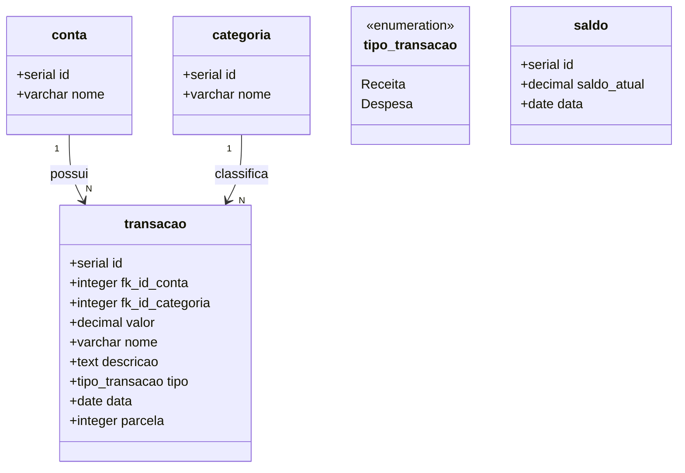

# FinTrack_Api

A **FinTrack API** é uma aplicação REST desenvolvida com **Spring Boot** que permite o controle de finanças pessoais. Com ela, o usuário pode registrar receitas, despesas e acompanhar o saldo disponível com facilidade.

### Tecnologias Utilizadas
* Java 21
* Spring Boot
* Spring Data JPA
* PostgreSQL
* Docker
* Maven
* Swagger